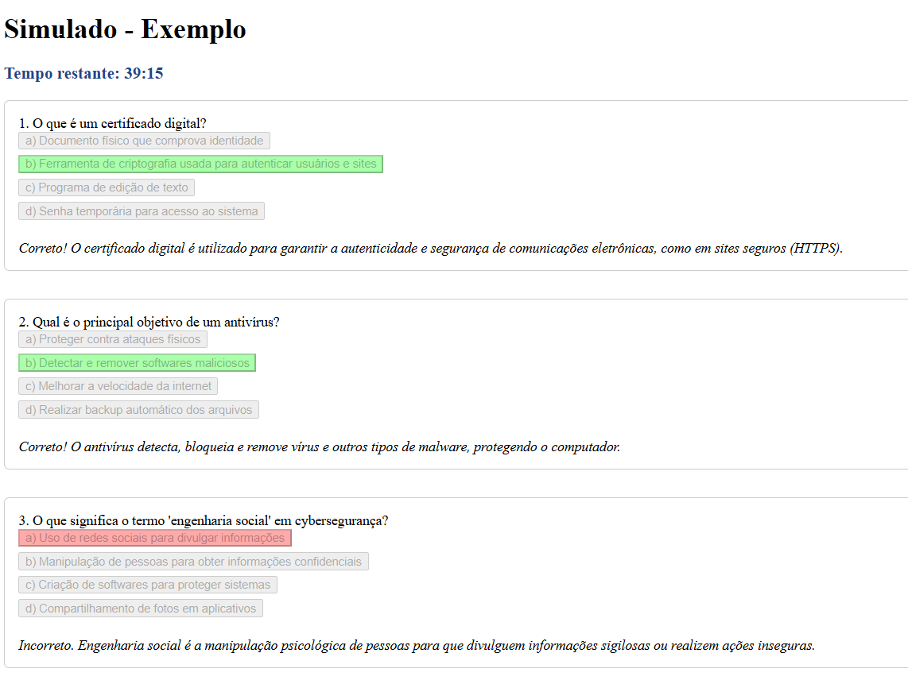
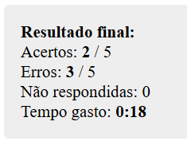

## Simulado
Este simulado foi desenvolvido como uma ideia inicial para facilitar e auxiliar estudos em momentos em que não houver simulados disponíveis. Ele serve como guia prático para quem deseja criar seu próprio simulado de forma rápida e eficiente, utilizando uma estrutura simples em HTML e JavaScript. O modelo permite apresentar perguntas de forma dinâmica, controlar o tempo de resposta e fornecer feedback imediato ao usuário, tornando o estudo mais interativo e personalizado. Além disso, este recurso foi utilizado para testar e consolidar conhecimentos adquiridos no curso de <a href="https://www.udemy.com/course/engenharia-de-prompts-com-ia/?srsltid=AfmBOopn8dginJHeItDNy300TBKV6gNK4C54r3UBVl1Cn8H_R25GZPW0&couponCode=KEEPLEARNINGBR" target="_blank">Engenharia de Prompts com IA</a>  .


 Estratégias de engenharia de prompts, essas estratégias ajudam a orientar o modelo de linguagem para gerar conteúdos mais precisos, criativos e funcionais: 

| **Estratégia**         | **Descrição**                                                                     | **Como Aplicar na Geração do Simulado**                                                                                                    | **Exemplo Prático de Prompt para o Simulado** |  
|------------------------|-----------------------------------------------------------------------------------|---------------------------------------------------------------------------------------------------------------------------------------|-------------------------------------------|  
| Chain of Thought       | Orienta o modelo a pensar passo a passo, detalhando o raciocínio.                 | Solicite que o modelo explique cada etapa do processo de criação do Simulado, do planejamento ao código final.                            | "Descreva passo a passo como gerar um Simulado interativo, incluindo estrutura de perguntas, lógica de respostas, timer e feedback visual." |  
| Role Play              | O modelo assume um papel específico.                                              | Peça para o modelo agir como um desenvolvedor front-end ou especialista em educação digital.                                          | "Finja que você é um desenvolvedor web especializado em Simuladores educacionais. Como você criaria um Simulado de segurança digital interativo?" |  
| Few-shot Prompting     | Exemplos são fornecidos para ilustrar como responder.                             | Apresente exemplos de perguntas formatadas antes de pedir ao modelo para criar novas seguindo o mesmo padrão.                          | "Aqui estão dois exemplos de perguntas para o Simulado: {…}. Crie mais três seguindo esse formato." |  
| Zero-shot Prompting    | O modelo recebe apenas a tarefa, sem exemplos prévios.                            | Peça para o modelo criar perguntas ou o código do Simulado apenas com a instrução básica, sem exemplos.                                   | "Crie um Simulado de cinco perguntas sobre segurança digital com alternativas e feedback imediato." |  
| Instruction Prompting  | O modelo recebe instruções explícitas sobre como responder ou formatar.            | Dê instruções claras sobre estrutura do array de perguntas, funcionalidades e estilo desejado.                                        | "Gere um array JavaScript de perguntas para um Simulado, cada uma com quatro alternativas, identificando a correta e incluindo explicação." |  
| Self-Consistency       | O modelo gera múltiplos raciocínios e escolhe a resposta mais comum/consistente.  | Peça para o modelo sugerir três abordagens de implementação do Simulado e escolher a mais eficiente ou didática.                          | "Proponha três formas diferentes de implementar um Simulado interativo em HTML/JS e selecione a mais didática para iniciantes." |  


### Funcionalidades principais:
- **Interface interativa** com perguntas de múltipla escolha.
- **Feedback automático** com explicações para cada resposta.
- **Controle de tempo** com contagem regressiva.
- **Cálculo de desempenho** ao final do simulado (acertos, erros e não respondidas).
- **Estilo visual simples e funcional**, com destaque para respostas corretas e incorretas

<p align="left">  
    
</p>  

## Como adicionar diferentes tipos de perguntas ao simulado

O simulado dinâmico utiliza um array de objetos JavaScript para representar cada pergunta. Cada objeto segue uma estrutura padrão e pode ser facilmente adaptado para incluir novos conteúdos.

### Estrutura básica de uma pergunta

```js
// ---- INÍCIO DO ARRAY ----  
    const questions = [  
{
  q: "Texto da pergunta",
  options: [
    "a) Alternativa A",
    "b) Alternativa B",
    "c) Alternativa C",
    "d) Alternativa D"
  ],
  answer: 1, // Índice da alternativa correta (começa em 0)
  explanation: "Explicação exibida após a resposta."
}

];  
    // ---- FIM DO ARRAY ----  
````
Basta solicitar à IA ou criar perguntas sobre o tema desejado, seguindo esse formato. Depois, insira cada pergunta em seu array de perguntas dentro do código do simulado.


## Como configurar o tempo do simulado

O tempo total do simulado é definido em segundos na variável `totalTime`. Essa configuração controla quanto tempo o usuário terá para responder todas as perguntas antes que o simulado seja encerrado automaticamente.

### Localização no código

```js
// Timer
let totalTime = 40 * 60; // minutos (em segundos) - ajuste como quiser
let timeLeft = totalTime;
let timerInterval = null;
let SimuladoStarted = false;
let SimuladoEnded = false;
````
### Como alterar o tempo
A fórmula usada é:

````js
totalTime = MINUTOS * 60;
````

Por exemplo:
Para 30 minutos, use:
````js
let totalTime = 30 * 60;
````

Para 1 hora, use:
````js
let totalTime = 60 * 60;
````

### Comportamento do timer

O tempo restante é exibido na tela e atualizado a cada segundo.
Quando o tempo chega a zero, o simulado é finalizado automaticamente com a mensagem "Tempo esgotado!".
O tempo gasto também é mostrado no resultado final.

<p align="left">  
    
</p>  


